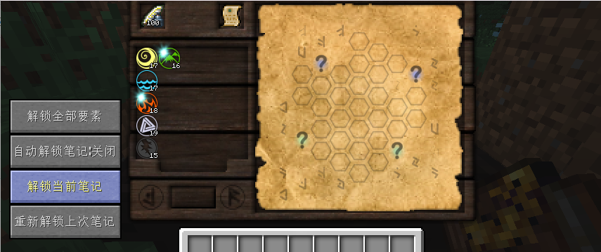
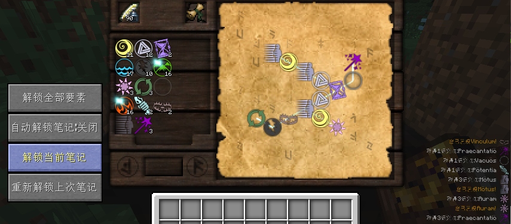
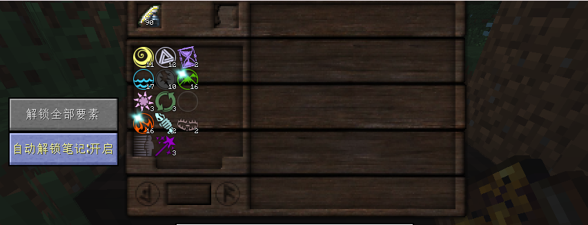
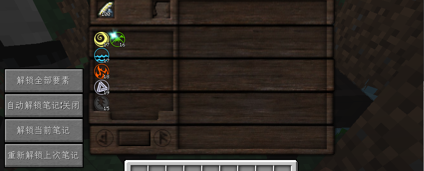
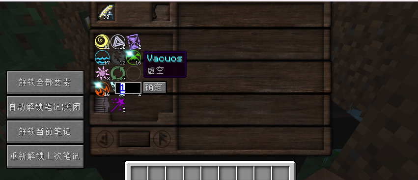

# TC4AutoResearch
我的世界1.7.10 神秘时代4模组 研究笔记 自动解锁

该项目Fork自[https://github.com/sailro/Shellify](https://github.com/wohaopa/TC4Helper)，感谢wohaopa写的代码作为参考

# 概要  
    记得十年前还在上大学的时候玩 神秘时代4 这个模组，就想着哪天要是能够实现自动解算笔记就好了，十年后的今天，总算是圆了自己的这个梦想
# 使用方法以及额外的功能和注意事项
    1.使用该Mod会替换掉ThaumcraftResearchTweaks的研究桌，而使用原版的研究桌
    2.使用方法很简单

  

2.1将笔记放入后，点击[解锁当前笔记]就行了,这时程序会自动解开 ? 也就是未知的元素，并补充足够的元素后连接各个元素并解锁笔记。
    
2.2注意：请不要将解锁到一半的笔记放入，虽然程序依旧会计算可能的解，但是因为笔记上已经存在大量的元素，会导致解算出错，从而导致失败，
    正确的做法是将已经研究到一半的笔记丢弃，重新取一张新的笔记放入。
    
2.3在游戏初期，很有可能笔墨以及元素会不足，这个时候，研究会进行到一半就终止，为此，我添加了[重新解锁上次笔记]这个按钮，
    用于重试上次的解锁过程(关闭研究桌，再打开研究桌不受影响，但是当游戏退出以后，包括退出服务器，那上次的研究数据依旧会被丢弃)。
    至于为什么不使用[解锁当前笔记],因为解锁笔记算法是一个随机算法，所以每次点击[解锁当前笔记]都会是一个新的解，所需的元素不同，因此才设置[重新解锁上次笔记]这个按钮。

  

    2.4在点击[解锁当前笔记]之后，如果你看到元素的数量在变动，以及右下角在不断的刷新各种元素，请不要动，这个时候，是程序在合成解锁笔记所需
    的元素种类和数量，等待元素数量足够以后，笔记会自动解锁，这个过程可能会比较漫长，请耐心。

  

    2.5如果觉得每次都点击按钮才能解锁笔记太过麻烦，可以点击[自动解锁笔记:关闭]按钮，当按钮显示为 [自动解锁笔记:开启]状态时，说明当前处于
    自动解锁状态，这个时候，只需要将笔记放入静待1秒钟，就能自动解锁笔记(请时刻关注左下脚的聊天窗口信息是否提示研究失败)
    
2.6虽然我自己测试，大部分笔记都能正常解锁，但是还是存在很少部分的笔记无法被程序解算(比如:神秘基础学Mod的[神秘盐块]笔记),这个时候
    左下脚的聊天窗口信息可能会显示[笔记解锁失败,算子解算失败,请手动连接各个元素],亦或者等待很久，什么反应都没有，这个时候就放弃让程序解算，
    手动连接吧，不过这种情况真的不多见，只能说Mod作者设置的笔记初始条件太过苛刻。
    
2.7解锁笔记会自动合成所有需要的高阶元素，但是，所有高阶元素都是由基础的元素合成的，所以请保证基础元素(风 水 火 秩序 毁灭 地)这几样元素充足，尤其是风和秩序，消耗量很大。

  

    3在玩家初期，全部元素都是？状态，需要手动合成解锁，为了方便，我添加了[解锁全部要素]按钮，当点击这个按钮后，会解锁所有可以解锁的元素，如果全部解锁了，那这个按钮会自动隐藏，如果因为基础元素不足导致解锁失败，可以在补充足够的基础元素后再次点击，再次点击不会重复合成已经有的元素，只会解锁未解锁的元素。

  

    4这是最后一个功能了，将鼠标指针指向你想合成的元素，按住Ctrl键然后点击鼠标左键，这个时候，会出现一个可以输入数字的框和[确定]按钮，输入你想合成这个元素的数量后点击[确定]，就能从基础元素开始合成指定数量的该元素，但是请保证基础元素足够。

最后的最后，祝大家玩的愉快，如果Mod使用上有任何问题，或者想添加新功能，请在Issue中提出
